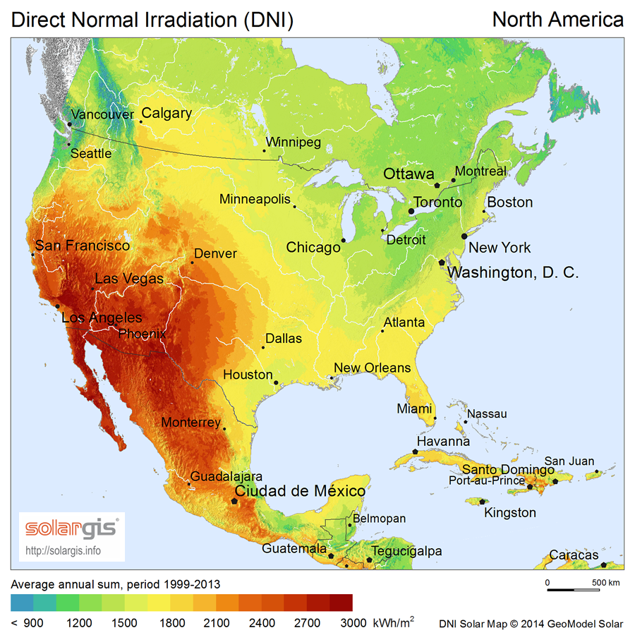
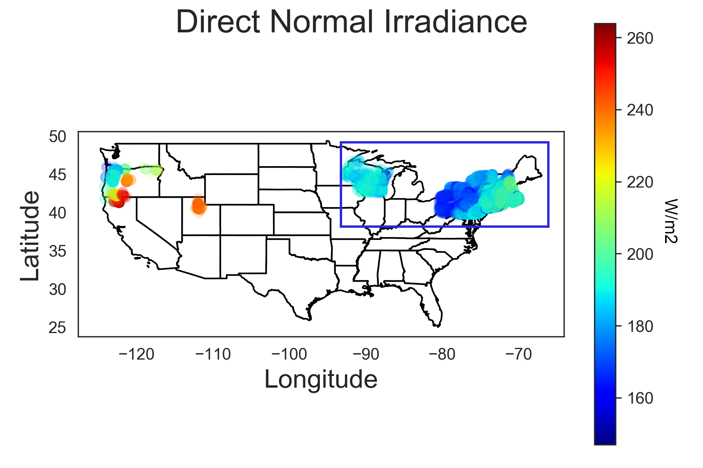
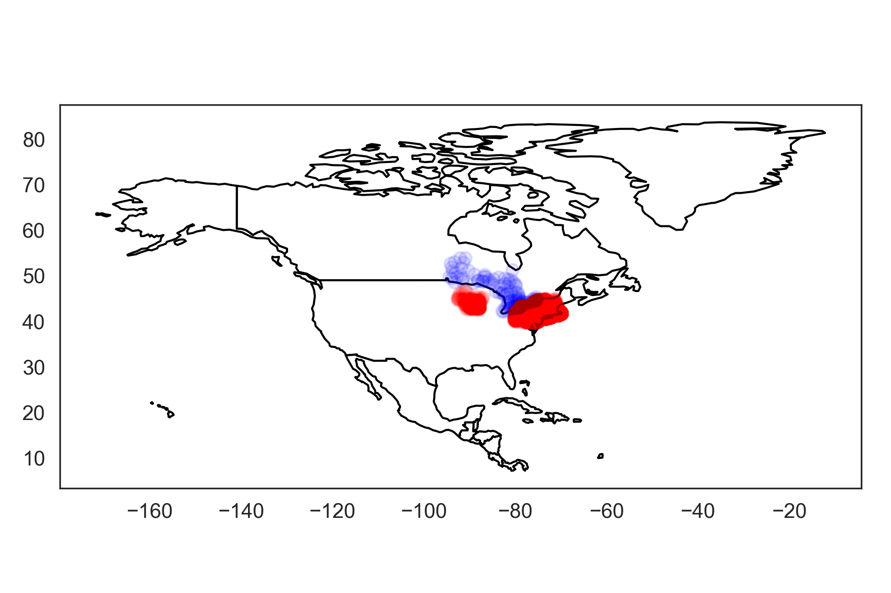

## GoSolar: accurately predicting photovoltaic installation power generation, cost and savings using machine learning and weather information 

**Author** Ivan Borozan 

About
=====

This is a short (3 week) data science project that I worked on as an [Insight](https://www.insightdatascience.com/) fellow. The project is about developing a machine learning regression model to accurately predict the energy output for residential solar panel installations in Ontario. 
 
## Data

The model is trained using real data obtained from two sources:

* a dataset collected from [photovoltaic (PV) installations](https://openpv.nrel.gov/) on the ground by the National Renewable Energy Project (NREL) a national laboratory of the US Department of Energy

* a dataset from the [National Solar Radiation Database (NSRDB)](https://nsrdb.nrel.gov/) that includes hourly measures of weather patterns such as radiation, position of the sun, temperature and wind speed

Solar and weather values for variables such as Global Horizontal Irradiance (GHI), Direct Horizontal Irradiance (DHI), Direct Normal Irradiance (DNI), Wind Speed, Temperature and Solar Zenith Angle downloaded from the NSRDB are averaged over a year. 

## EDA - short summary

Due to a significant difference in solar irradiance along the four cardinal directions North/South and East/West (as shown in the Figures A and B below)  

 A.
  
 B.                                                                                                   
   

only solar installations in the US located within a blue rectangular region shown in Figure B above are included in the analysis.

In the Figure C below we show the same US installations (red) and their proximity to communities in Ontario (blue).

 C.
    

## Data set used for machine learning regression model selection, training and validation 

After data processing and feature selection 7 numerical features

- Size (kW)
- array tilt
- Temperature
- Wind Speed
- Azimuth
- Direct Normal Irradiance
- Direct Horizontal Irradiance 

and 76859 data points were used for training, validation, model selection and evaluation on the test set (for more details about the model and the analysis performed see the [technical report](./notebooks/solar_eda_and_technical_report.ipynb)).  

## Web app

The final product is a user friendly [webb app](./webapp/solar_demo.gif) developed to help Ontario residents predict their solar installation annual energy output and other key characteristics with improved accuracy.

Based on geographical location, panel size, roof pitch and its orientation the GoSolar web app provides predictions for:

* Annual Energy Output (kWh/year)
* Annual Return (CAD)
* Installation cost (CAD)
* Break Even Time (Years)
* Optimal Tilt (degrees)
