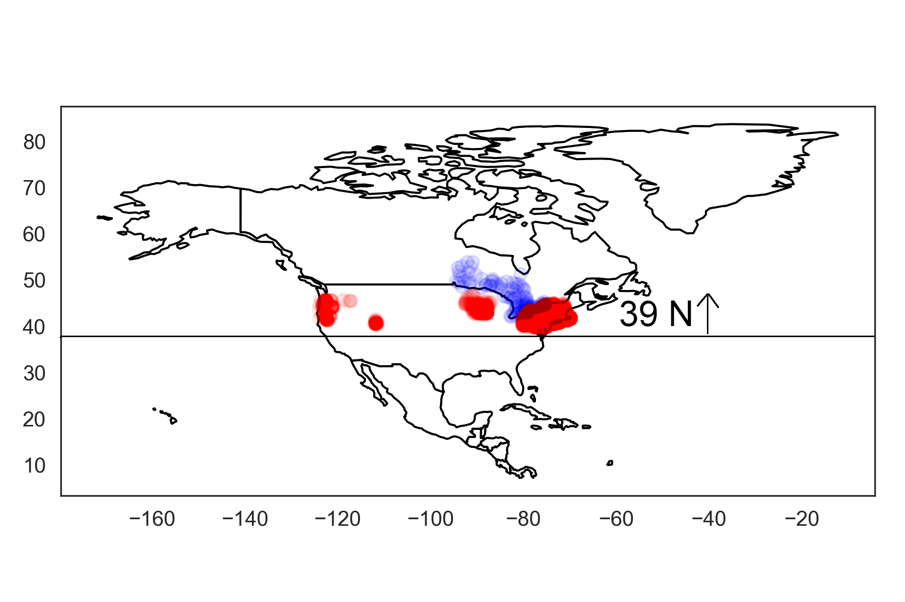
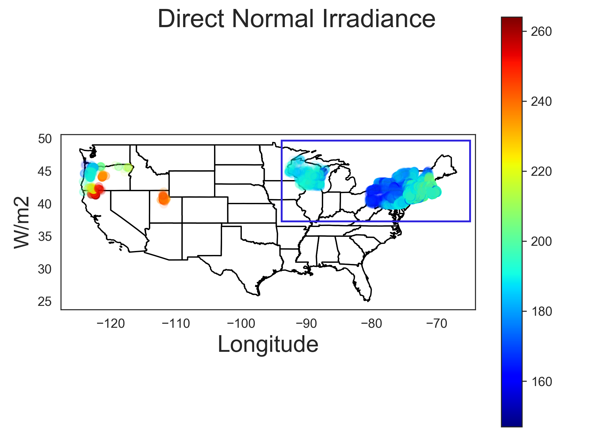

## GoSolar: accurately predicting photovoltaic installation power generation using machine learning and weather information 

**Author** Ivan Borozan 

About
=====

Developed a machine learning based model to accurately predict the energy output for residential solar panel installations in Ontario. 

**Data**

The model is trained using real data obtained from two sources:

* a dataset collected from [photovoltaic (PV) installations](https://openpv.nrel.gov/) on the ground by the National Renewable Energy Project (NREL) a national laboratory of the US Department of Energy

* a dataset from the [National Solar Radiation Database (NSRDB)](https://nsrdb.nrel.gov/) that includes hourly measures of weather patterns such as radiation, position of the sun, temperature and wind speed

Variables such as Global Horizontal Irradiance (GHI), Direct Horizontal Irradiance (DHI), Direct Normal Irradiance (DNI), Wind Speed, Temperature and Solar Zenith Angle were averaged over a year. 

**EDA short summary**

Based on solar irradiation data decided to include only US installations along the US/Canada border (shown in red).

  
   

There is a significant difference in Direct Normal Irradiance between the East and West coast. Decided to include only installations > -100 degree East for further analysis. 

    

After data processing and feature selection 8 numerical features were used in the training and validation steps: 

- Size (kW)
- array tilt
- Temperature
- Wind Speed
- Azimuth
- Direct Normal Irradiance
- Direct Horizontal Irradiance 
- Global Horizontal Irradiance 

**Web app**

The final product is a user friendly [webb app](http://hbaranalytics.com:5000) developed to help Ontario residents predict their solar installation annual energy output and other key characteristics with improved accuracy.

Based on geographical location, panel size, roof pitch and its orientation GoSolar web app provides predictions for:

* Annual Energy Output (kWh/year)
* Annual Return (CAD)
* Installation cost (CAD)
* Break Even Time (Years)
